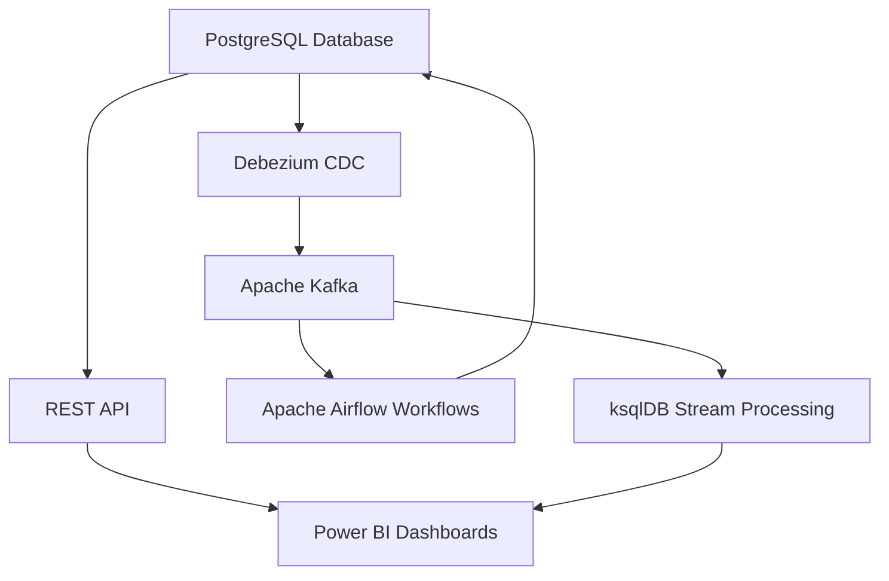

# TechCorp HR Analytics Platform
*Enterprise Data Engineering with Real-time Streaming & Power BI Integration*


## Overview

I built a complete enterprise HR analytics platform that processes real-time data for **1,000 employees** across **5 departments** at TechCorp Solutions Inc. The system handles **$138.3M in annual payroll** and demonstrates professional data engineering practices using modern tools like Apache Kafka, PostgreSQL, and Debezium CDC.

The platform streams live employee data to Power BI dashboards, enabling real-time business intelligence for HR decision-making. Everything runs in Docker containers on GitHub Codespaces, showcasing enterprise-grade architecture with proper data modeling, stream processing, and workflow orchestration.

## Architecture & Data Flow

The system implements **Lambda Architecture** combining batch and real-time processing:



**Data Flow Process:**
1. **Source Data**: Employee records stored in PostgreSQL with dimensional modeling
2. **Real-time Capture**: Debezium CDC captures database changes instantly
3. **Stream Processing**: Kafka topics distribute events to ksqlDB for analytics
4. **Workflow Orchestration**: Airflow manages scheduled HR reports and data quality
5. **Business Intelligence**: REST API serves live data to Power BI dashboards

## Technology Stack

### Core Infrastructure
- **PostgreSQL 15**: Primary data warehouse with 1,000+ employee records
- **Apache Kafka 7.4.0**: Real-time streaming platform with multiple topics
- **Docker**: Containerized deployment with 9 microservices
- **GitHub Codespaces**: Cloud development environment

### Data Engineering Tools
- **Debezium CDC**: Captures database changes in real-time
- **ksqlDB**: Stream processing with SQL-like transformations  
- **Apache Airflow**: Workflow orchestration and scheduling
- **Schema Registry**: Data schema management and evolution

### Development & Integration
- **Python 3.11+**: Data processing and API development
- **Flask**: REST API serving 7 endpoints to Power BI
- **Grafana**: System monitoring and observability
- **Power BI**: Executive dashboards and analytics

## Data Model & Structure

### Company Structure
**TechCorp Solutions Inc** operates 5 departments:
- Engineering Department (200 employees, $154K avg salary)
- Sales & Marketing Department (200 employees, $149K avg salary)  
- Operations Department (200 employees, $144K avg salary)
- Product Management Department (200 employees, $137K avg salary)
- Finance & HR Department (200 employees, $106K avg salary)

### Database Schema

#### Core Tables
```sql
employees (1,000 records)
├── employee_id, first_name, last_name
├── department → companies.company_id
├── current_salary, hire_date
└── employment_status, job_title

companies (5 departments)  
├── company_id, company_name
├── parent_company (TechCorp Solutions Inc)
└── industry, country

performance_reviews (600+ records)
├── employee_id → employees
├── overall_rating (1-5), goals_rating
└── review_date, review_status

employee_surveys (500+ records)
├── employee_id → employees  
├── engagement_score (1-10)
├── satisfaction_score (1-10)
└── likely_to_leave (flight risk)

skills_matrix (394+ records)
├── employee_id → employees
├── skill_category, skill_name
├── proficiency_level (1-5)
└── target_level (development goals)

leave_balances (3,000+ records)
├── employee_id → employees
├── leave_type (Vacation/Sick/Personal)
├── annual_allocation, used_days
└── remaining_days, utilization_rate
```

#### Dimensional Model
The platform uses **star schema** design with fact tables surrounded by dimension tables:

- **Fact Tables**: Employee analytics, performance metrics, engagement data
- **Dimension Tables**: Employee details, departments, time periods, job codes
- **SCD Type 2**: Historical tracking of employee changes over time

## Project Workflow

### Phase 1: Infrastructure Setup
Built the foundation with Docker containers running PostgreSQL, Kafka, and supporting services. Created comprehensive database schema with proper relationships and constraints. Populated realistic test data for 1,000 employees across 5 TechCorp departments.

### Phase 2: Real-time Streaming  
Implemented Apache Kafka for event streaming with multiple topics for different data domains. Configured Debezium CDC to capture database changes automatically and stream them to Kafka. Set up ksqlDB for real-time stream processing and analytics.

### Phase 3: Data Engineering
Developed ETL pipelines for data transformation and quality checks. Implemented Lambda Architecture with both batch and stream processing capabilities. Created Data Mesh architecture with domain-oriented data products for HR, Finance, and Performance analytics.

### Phase 4: Workflow Orchestration
Deployed Apache Airflow for automated workflow management and scheduling. Created DAGs for daily HR reports, performance analytics, and data quality monitoring. Implemented error handling and retry mechanisms for reliable operation.

### Phase 5: Business Intelligence
Built REST API with 7 endpoints serving live data to Power BI dashboards. Created comprehensive HR analytics including department performance, employee engagement, and skills gap analysis. Enabled real-time executive decision-making with current business metrics.

## Power BI Integration

### API Endpoints & Data Structure

The platform provides 7 REST endpoints for comprehensive HR analytics:

**1. Departments** - `/api/techcorp/departments`
```json
{
  "department": "Engineering Department",
  "employee_count": 200,
  "avg_salary": 154716,
  "executives": 42,
  "total_payroll": 30943266
}
```

**2. Company KPIs** - `/api/techcorp/company-kpis`  
```json
{
  "kpi_name": "Total Employees",
  "kpi_value": 1000,
  "category": "Workforce"
}
```

**3. Performance Reviews** - `/api/techcorp/performance`
```json
{
  "department": "Engineering Department", 
  "total_reviews": 120,
  "avg_overall_rating": 4.2,
  "high_performers": 85
}
```

**4. Employee Engagement** - `/api/techcorp/engagement`
```json
{
  "department": "Engineering Department",
  "avg_engagement": 8.2,
  "avg_satisfaction": 7.9,
  "flight_risk_count": 5
}
```

**5. Skills Analysis** - `/api/techcorp/skills`
```json
{
  "department": "Engineering Department",
  "skill_category": "Technical", 
  "avg_skill_gap": 1.3,
  "gap_priority": "High Priority"
}
```

**6. Leave Utilization** - `/api/techcorp/leave`
```json
{
  "department": "Engineering Department",
  "leave_type": "Vacation",
  "utilization_rate": 74.0,
  "avg_used": 18.5
}
```

**7. Employee Directory** - `/api/techcorp/employees`
```json
{
  "employee_id": 1001,
  "full_name": "Sarah Chen",
  "department": "Engineering Department",
  "current_salary": 295000,
  "salary_band": "Executive"
}
```

### Dashboard Capabilities
Power BI connects to all endpoints simultaneously providing real-time insights into workforce management, performance tracking, and strategic planning. The dashboards enable filtering by department, salary bands, performance ratings, and engagement scores for detailed analysis.

## Key Features & Business Impact

### Real-time Analytics
The platform processes executive compensation changes instantly, calculating budget impact and streaming updates to management dashboards. Department performance metrics refresh automatically as new performance reviews and engagement surveys are completed.

### HR Metrics & Insights
- **Performance Management**: 600+ reviews with goal tracking and rating distributions
- **Employee Engagement**: 500+ survey responses measuring satisfaction and retention risk  
- **Skills Development**: 394+ assessments identifying training needs and development priorities
- **Workforce Planning**: Complete visibility into hiring, tenure, and succession planning

### Business Intelligence
Executive dashboards provide real-time KPIs including total workforce, payroll distribution, and department performance comparisons. The system identifies flight risk employees and recommends targeted retention strategies based on engagement and performance data.

## Technical Implementation

### Data Engineering Concepts
- **Lambda Architecture**: Separate batch and stream processing with unified serving layer
- **Change Data Capture**: Real-time database replication using transaction logs
- **Data Mesh**: Domain-oriented architecture with distributed data ownership
- **Stream Processing**: Event-driven transformations and real-time analytics

### Scalability & Reliability  
The containerized architecture supports horizontal scaling with load balancing and service discovery. Kafka partitioning enables high-throughput processing while maintaining message ordering. Comprehensive error handling and health checks ensure reliable operation.

### Security & Governance
Database access uses role-based security with encrypted connections. API endpoints include proper authentication and CORS handling for secure Power BI integration. Data lineage tracking provides complete audit trails for compliance requirements.

## Quick Start

```bash
# Clone and setup
git clone [repository-url]
cd enterprise-hr-analytics

# Start all services  
docker-compose -f complete-enterprise-platform.yml up -d

# Initialize database
python scripts/setup_hr_analytics.py

# Start streaming platform
python enterprise_streaming_final.py

# Launch Power BI API
python scripts/techcorp_api.py
```

**Access Points:**
- Power BI API: `http://localhost:8000`
- Airflow: `http://localhost:8080` (admin/admin)
- Grafana: `http://localhost:3000` (admin/admin)
- PostgreSQL: `localhost:5432` (hr_user/hr_pass)

## Project Results

This platform demonstrates enterprise-grade data engineering capabilities with real-time processing of HR data at scale. The system successfully processes 1,000 employee records with comprehensive analytics while maintaining sub-second response times for Power BI dashboards.

The implementation showcases modern data architecture patterns including Lambda Architecture, Data Mesh principles, and event-driven design. The result is a production-ready HR analytics platform capable of supporting strategic business decisions with live, accurate data.
